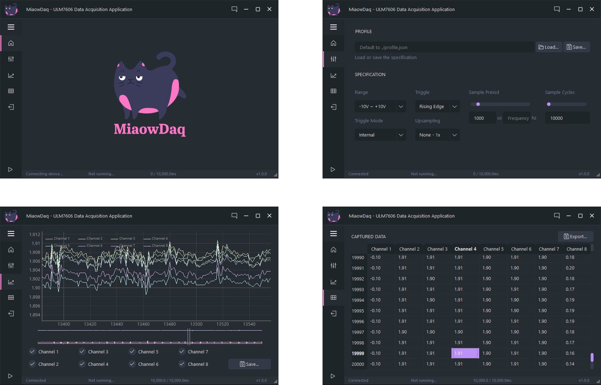

## 使用MiaowDaq

包含视频说明，下文视频显示不正常，查看[./readme.assets](./readme.assets)目录

### UI截图


### 采集
1. 启动后自动尝试连接设备，连接后跳转到设置页面，状态栏显示Connected
  > 未连接设备时，无法点击进入设置、曲线、表格页面

2. 设置采集卡参数

3. 点击左下角开始采集后跳转到曲线页面，按设定的采样方式、采样率，连续采集直到达到设定的采样数量
  > 状态栏有提示采样时间进度

<video src="./readme.assets/采集.mp4"></video>

### 查看数据

#### 曲线页面

- 勾选要查看的通道
- 用滚动条快速选择范围
- 在曲线上左键拖动，滚轮比例缩放，右键拖动按轴缩放

<video src="./readme.assets/查看曲线.mp4"></video>

#### 表格页面

所有通道的数值

<video src="./readme.assets/查看表格.mp4"></video>

### 导出数据

曲线页面上的保存按钮，保存当前的曲线视图为`png`、`svg`图像。表格页面的导出按钮，可以导出这次采样的所有数据，支持`csv`和`numpy`格式

<video src="./readme.assets/导出数据.mp4"></video>

### 设置参数

设置页面上可以设置采集卡的参数。每次软件启动后，采集卡参数默认加载软件目录下的`profile.json`，配置文件路径提示在文本框中

手动保存当前参数到其他配置文件，或者手动加载了其他被指文件后，文本框中的配置文件路径会改变

> 无论是否切换或手动保存配置文件，软件退出时，当前的参数自动存储到文本框显示的文件路径中

<video src="./readme.assets/设置参数.mp4"></video>

#### 提示和帮助

左侧菜单展开后有界面提示

右侧面板为帮助

<video src="./readme.assets/提示和帮助.mp4"></video>

## 部署

安装[requirements.txt](./requirements.txt)，运行[main.py](main.py)
```shell
$ pip3 install -r requirements.txt
$ python3 main.py
```

